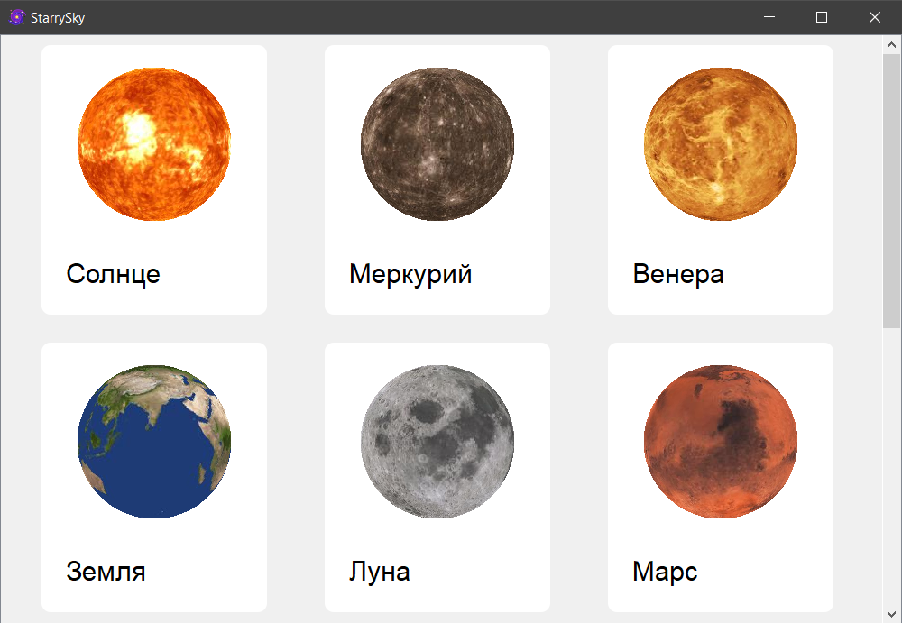
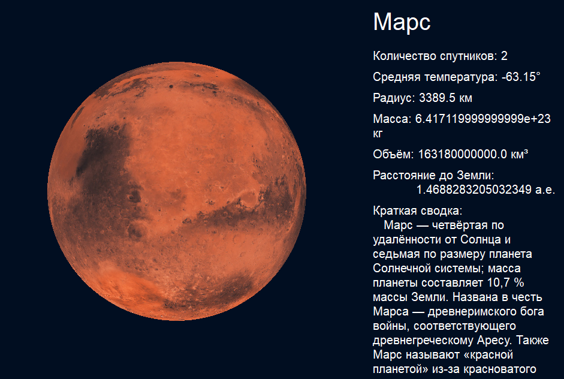

# StarrySky
### Для запуска
1. Скачайте [зависимости](requirements.txt)
```sh
pip install -r requirements.txt
```
2. Запустите [скрипт](image_resizer.py)
```sh
python image_resizer.py
```
3. Запустите [приложение](main.py)
```sh
python main.py
```
### Описание
После запуска программы появится окно:



При наведении мыши на карточку тела она начнет вращаться. \
При нажатии на интересующую вас небесное тело вы попадете на ее страницу 
с подробной информацией о ней:
* кол-во спутников
* средняя темпиратура
* масса
* объем
* радиус
* (ТЕКУЩЕЕ) расстояние до Земли
* актуальное описание планеты



###Техническая сторона
Для создания интерфейса используется [PyQt5](https://doc.qt.io/qtforpython/contents.html) c интегрированным
[OpenGL](https://www.opengl.org/) для отрисовки объемных тел

Актуальные данные берутся из нескольких источников:
1. [Текущее расстояние](https://rhodesmill.org/pyephem/)
2. [Характеристики небесного тела](http://api.le-systeme-solaire.net/en/)
3. [Актуальное описание](https://www.mediawiki.org/wiki/API:Main_page/ru)